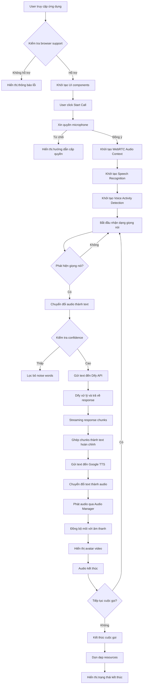
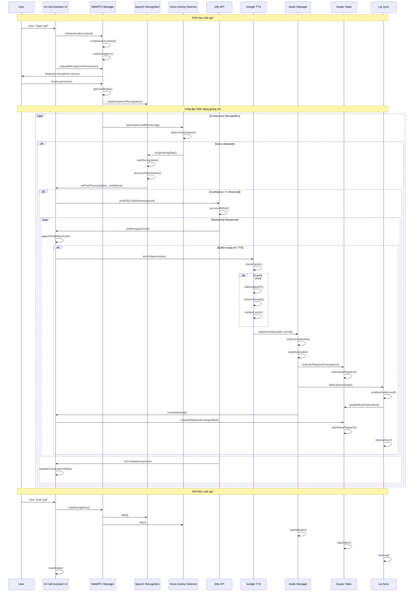
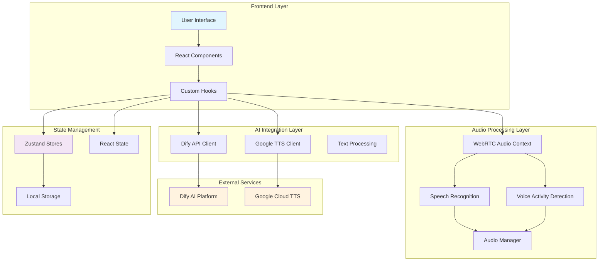

# AI Call Assistant - Chat Bot với Dify và Gemini

Ứng dụng chat bot thông minh tích hợp AI Call Assistant, hỗ trợ nhận dạng giọng nói, tổng hợp giọng nói và tương tác với mô hình ngôn ngữ lớn thông qua Dify API.

## 🚀 Tính năng chính

### AI Call Assistant
- **Cuộc gọi AI thời gian thực** với WebRTC
- **Nhận dạng giọng nói** sử dụng Web Speech API
- **Tổng hợp giọng nói** với Google Text-to-Speech
- **Tương tác AI** thông qua Dify API
- **Quản lý âm thanh thông minh** với Audio Manager
- **Khử tiếng vọng** và giảm tiếng ồn

### Chat Bot
- **Giao diện chat** thân thiện
- **Streaming responses** từ Dify API
- **Markdown rendering** với syntax highlighting
- **Copy code** functionality
- **Session management** với HUB API
- **Chat history** và lưu trữ tin nhắn

### Voice Contact Demo
- **Demo giọng nói** đơn giản
- **Audio caching** để tối ưu hiệu suất
- **Error handling** và retry logic

### Debug & Monitoring
- **Debug Controls UI** để điều khiển log levels
- **Enhanced logging** với màu sắc rõ ràng
- **Log debouncing** để giảm spam
- **Performance tracking** và monitoring
- **Race condition prevention** trong audio recognition

## 🏗️ Kiến trúc hệ thống

### Công nghệ chính được sử dụng

#### **Frontend Framework**
- **Next.js 15.4.5** - React framework với App Router
- **React 19.1.0** - UI library chính
- **TypeScript 5** - Type safety và development experience

#### **UI/UX Libraries**
- **Tailwind CSS 4** - Utility-first CSS framework
- **shadcn/ui** - Component library với Radix UI primitives
- **Framer Motion 12.23.12** - Animation library
- **Lucide React** - Icon library

#### **Audio & Voice Processing**
- **Web Speech API** - Nhận dạng giọng nói
- **Google Cloud Text-to-Speech** - Tổng hợp giọng nói
- **WebRTC** - Real-time audio communication
- **Wavesurfer.js** - Audio visualization

#### **AI & API Integration**
- **Dify API** - AI conversation platform
- **Google Cloud APIs** - TTS và Speech-to-Text
- **Axios** - HTTP client

#### **State Management**
- **Zustand 5.0.7** - Lightweight state management
- **Custom React Hooks** - Business logic encapsulation

#### **Development Tools**
- **ESLint** - Code linting
- **TypeScript** - Type checking
- **Tailwind CSS** - Styling

### Activity Diagram - Luồng hoạt động tổng quan



### Sequence Diagram - Luồng tương tác chi tiết



### Detailed Component Interaction Flow



## 📁 Cấu trúc thư mục

```
chat-bot-dify-gemini/
├── app/                          # Next.js App Router
│   ├── (main)/                   # Main layout group
│   │   ├── chat-bot/             # Chat Bot page
│   │   └── layout.tsx            # Main layout
│   ├── globals.css               # Global styles
│   ├── layout.tsx                # Root layout
│   └── page.tsx                  # Home page
├── components/                   # React components
│   ├── auth/                     # Authentication components
│   ├── chat-bot/                 # Chat Bot components
│   ├── customs/                  # Custom components
│   ├── layouts/                  # Layout components
│   ├── providers/                # Context providers
│   └── ui/                       # UI components (shadcn/ui)
├── hooks/                        # Custom React hooks
├── lib/                          # Core libraries
│   ├── audio/                    # Audio management
│   ├── axios/                    # HTTP client configuration
│   ├── config/                   # Configuration files
│   ├── fetch/                    # API clients
│   ├── google/                   # Google TTS integration
│   ├── hooks/                    # Custom React hooks
│   ├── stores/                   # Zustand stores
│   ├── utils/                    # Utility functions
│   ├── webrtc/                   # WebRTC utilities
│   └── logger.ts                 # Logging system
├── public/                       # Static assets
│   ├── models/                   # AI models and assets
│   └── textures/                 # Texture files
├── types/                        # TypeScript type definitions
├── package.json                  # Dependencies
├── tailwind.config.ts            # Tailwind configuration
├── tsconfig.json                 # TypeScript configuration
└── next.config.ts                # Next.js configuration
```

## 🔧 Cài đặt và chạy

### Yêu cầu hệ thống
- **Node.js 18+** - JavaScript runtime
- **npm hoặc yarn** - Package manager
- **Microphone và speaker** - Cho tính năng voice
- **Chrome/Edge browser** - Hỗ trợ Web Speech API tốt nhất

### Cài đặt dependencies
```bash
# Clone repository
git clone <repository-url>
cd chat-bot-dify-gemini

# Cài đặt dependencies
npm install
```

### Cấu hình môi trường
Tạo file `.env` trong thư mục gốc với các biến sau (xem chi tiết trong `ENV_SETUP.md`):
```env
# Google Cloud API Configuration
NEXT_PUBLIC_GOOGLE_CLOUD_API_KEY=your_google_cloud_api_key_here
NEXT_PUBLIC_GOOGLE_CLIENT_ID=your_google_client_id_here

# Dify API Configuration
NEXT_PUBLIC_DIFY_API_BASE_URL=https://api.dify.ai/v1
NEXT_PUBLIC_DIFY_API_KEY=your_dify_api_key_here

# Application Configuration
NEXT_PUBLIC_API_BASE_URL=http://localhost:3001

# Development Configuration
NODE_ENV=development
```

### Chạy development server
```bash
# Chạy development server với Turbopack
npm run dev

# Hoặc chạy trên port khác
npm run dev -- --port 3000
```

### Build production
```bash
# Build ứng dụng
npm run build

# Chạy production server
npm start

# Hoặc chạy trên port khác
npm start -- --port 3000
```

### Linting và Formatting
```bash
# Chạy ESLint
npm run lint

# Fix ESLint errors
npm run lint -- --fix
```

## 🐛 Troubleshooting

### Vấn đề về Log Spam
- Sử dụng **Debug Controls** (góc phải dưới) để điều chỉnh log level
- Thêm `?debug=true` vào URL để bật debug mode
- Sử dụng log level **ERROR** hoặc **WARN** để giảm spam
- Kiểm tra `localStorage.setItem('debug', 'false')` để tắt debug

### Vấn đề về Audio Recognition
- **InvalidStateError**: Refresh trang và thử lại
- **Microphone permission**: Kiểm tra quyền truy cập microphone
- **Browser support**: Sử dụng Chrome hoặc Edge
- **No speech detected**: Kiểm tra microphone hoạt động và không bị mute

### Vấn đề về API
- Kiểm tra file `.env` có đầy đủ API keys
- Xem chi tiết trong `ENV_SETUP.md`
- Kiểm tra console logs để debug
- Verify API keys có quyền truy cập đúng services

### Performance Issues
- Tắt debug mode khi không cần thiết
- Sử dụng log level ERROR để giảm overhead
- Kiểm tra memory usage trong browser dev tools
- Clear browser cache nếu gặp vấn đề về audio caching

### Authentication Issues
- Kiểm tra Google OAuth configuration
- Verify `NEXT_PUBLIC_GOOGLE_CLIENT_ID` đúng
- Clear localStorage nếu gặp vấn đề về auth state

## 🎯 Các thành phần chính

### 1. Chat Bot System (components/chat-bot/)
- **ChatArea**: Giao diện chat chính với streaming responses
- **ChatInput**: Input field với voice input support
- **ChatMessages**: Hiển thị tin nhắn với markdown rendering
- **ChatHeader**: Header với controls và session management
- **ChatHistory**: Lịch sử chat và session management

### 2. Dify API Integration (lib/fetch/call-api-deify.ts)
- **Chức năng**: Tương tác với mô hình AI
- **Modes**: Streaming và Blocking
- **Features**: 
  - SSE streaming với chunk batching
  - Request deduplication
  - Performance tracking
  - Error handling và retry logic
  - Cache management

### 3. Google Text-to-Speech (lib/google/text-to-speech.ts)
- **Chức năng**: Chuyển đổi văn bản thành giọng nói
- **Tính năng**:
  - Cache TTL 5 phút với intelligent cleanup
  - In-flight deduplication
  - Smart text chunking cho Vietnamese
  - Multiple voice presets
  - Performance monitoring

### 4. Audio Manager (lib/audio/audio-manager.ts)
- **Chức năng**: Điều phối phát âm thanh toàn cục
- **Thứ tự ưu tiên**: system > tts > webrtc > demo
- **API**: `registerAudio()`, `unregisterAudio()`, `stopCurrentAudio()`
- **Features**: Priority management, error recovery, autoplay handling

### 5. Speech Recognition (lib/webrtc/speech-recognition-manager.ts)
- **Chức năng**: Nhận dạng giọng nói
- **Tính năng**:
  - Auto-restart với debouncing
  - Noise word filtering
  - AI speaking state management
  - Confidence threshold optimization
  - Race condition prevention

### 6. State Management (lib/stores/)
- **AuthStore**: Quản lý authentication state
- **ChatBotDifyStore**: Quản lý chat state và messages
- **ChatBotHubStore**: Quản lý session và chat history
- **Features**: Zustand-based, persistent storage, real-time updates

### 7. Logging System (lib/logger.ts)
- **Chức năng**: Structured logging với performance tracking
- **Features**:
  - Multiple log levels (ERROR, WARN, INFO, DEBUG)
  - Color-coded console output
  - Log debouncing để giảm spam
  - Performance metrics tracking
  - Environment-based configuration

## 🔄 Luồng hoạt động chi tiết

### 1. Khởi tạo ứng dụng (Application Initialization)

#### Browser Support Check
```typescript
// Kiểm tra hỗ trợ Web Speech API và WebRTC
const isSupported = typeof window !== 'undefined' && 
  ('webkitSpeechRecognition' in window || 'SpeechRecognition' in window) &&
  typeof AudioContext !== 'undefined';
```

#### Component Mounting
1. **Home Component**: Khởi tạo UI và state management
2. **Custom Hooks**: Load các hook cần thiết (useSpeechToDify, useAvatarVideo)
3. **Device Detection**: Phát hiện loại thiết bị (mobile/tablet/desktop)
4. **Logger Setup**: Khởi tạo logging system với debug controls

### 2. Voice Call Initialization Flow

#### Microphone Permission Request
```typescript
// Enhanced permission request với device-specific handling
const requestPermission = async () => {
  const audioConstraints = {
    echoCancellation: true,
    noiseSuppression: true,
    autoGainControl: true,
    sampleRate: { ideal: 44100, min: 16000 }
  };
  
  const stream = await navigator.mediaDevices.getUserMedia({ 
    audio: audioConstraints 
  });
};
```

#### WebRTC Audio Context Setup
1. **AudioContext Creation**: Tạo audio context với mobile optimization
2. **Analyser Setup**: Khởi tạo analyser cho voice activity detection
3. **Microphone Connection**: Kết nối microphone stream với analyser
4. **Performance Tracking**: Bắt đầu tracking performance metrics

### 3. Speech Recognition Flow

#### Voice Activity Detection (VAD)
```typescript
// Enhanced VAD với AI voice filtering
const detectVoiceActivity = () => {
  const isAIVoiceLevel = level > 0 && level < 20 && levelChange < 3;
  const isHumanVoiceLevel = level > 25 && levelChange > 4;
  
  // Filter out AI voice levels more aggressively
  const filteredLevel = isAIVoiceLevel ? level * 0.05 : level;
};
```

#### Speech Processing Pipeline
1. **Audio Capture**: Thu âm từ microphone với noise suppression
2. **Voice Detection**: Phát hiện giọng nói với confidence threshold
3. **Text Conversion**: Chuyển đổi audio thành text qua Web Speech API
4. **Noise Filtering**: Lọc bỏ noise words và low confidence results
5. **Auto Send**: Tự động gửi text nếu đạt confidence threshold

### 4. AI Integration Flow

#### Dify API Communication
```typescript
// Streaming mode với chunk batching
const postDifyChatStream = async (request, callbacks) => {
  const response = await fetch(url, {
    method: 'POST',
    headers: getDifyHeaders(),
    body: JSON.stringify(request)
  });
  
  const reader = response.body.getReader();
  let buffer = '';
  
  while (true) {
    const { done, value } = await reader.read();
    if (done) break;
    
    buffer += new TextDecoder().decode(value);
    // Process chunks and call callbacks
  }
};
```

#### Response Processing
1. **Streaming Reception**: Nhận streaming chunks từ Dify API
2. **Chunk Batching**: Ghép chunks với delay 50ms để tối ưu UI
3. **Text Assembly**: Ghép chunks thành text hoàn chỉnh
4. **Markdown Rendering**: Render markdown với syntax highlighting
5. **State Update**: Cập nhật conversation state và history

### 5. Text-to-Speech Flow

#### Cache Management
```typescript
// Intelligent caching với TTL và cleanup
const textToSpeech = async (text, preset = 'natural') => {
  const cacheKey = generateCacheKey(text, preset);
  const cached = cache.get(cacheKey);
  
  if (cached && !isExpired(cached)) {
    return cached.audioUrl;
  }
  
  // Call Google TTS API
  const audioUrl = await callGoogleTTS(text, preset);
  cache.set(cacheKey, { audioUrl, timestamp: Date.now() });
  
  return audioUrl;
};
```

#### Audio Processing Pipeline
1. **Text Cleaning**: Làm sạch text cho TTS (loại bỏ markdown, format số)
2. **Cache Check**: Kiểm tra cache trước khi gọi API
3. **API Call**: Gọi Google Cloud TTS với voice preset
4. **Audio Conversion**: Chuyển đổi base64 thành audio blob
5. **Audio Registration**: Đăng ký audio với Audio Manager
6. **Playback**: Phát audio với priority management

### 6. Audio Management Flow

#### Priority System
```typescript
// Audio priority management
const audioPriorities = {
  system: 10,    // System sounds
  tts: 9,        // Text-to-speech
  webrtc: 8,     // WebRTC audio
  demo: 7        // Demo audio
};

const registerAudio = (type, audio, priority) => {
  // Stop current audio if higher priority
  if (priority > currentPriority) {
    stopCurrentAudio();
  }
  
  currentAudio = { type, audio, priority };
  audio.play();
};
```

#### Lip Sync Integration
1. **Audio Analysis**: Phân tích audio level với WebAudio API
2. **Mouth Movement**: Tính toán độ mở miệng dựa trên audio level
3. **Video Sync**: Đồng bộ video avatar với âm thanh
4. **Smooth Animation**: Tạo animation mượt mà cho avatar

### 7. Error Handling & Recovery

#### Error Classification
```typescript
const errorTypes = {
  'not-allowed': 'Microphone permission denied',
  'no-speech': 'No speech detected',
  'network': 'Network connection error',
  'audio-capture': 'Audio capture failed',
  'service-not-available': 'Speech service unavailable'
};
```

#### Recovery Mechanisms
1. **Automatic Retry**: Retry với exponential backoff
2. **Fallback Strategies**: Sử dụng alternative methods
3. **User Notification**: Hiển thị error message rõ ràng
4. **State Recovery**: Khôi phục state về trạng thái ổn định
5. **Resource Cleanup**: Dọn dẹp resources khi có lỗi

### 8. Performance Optimization

#### Memory Management
```typescript
// Automatic cleanup và memory optimization
const cleanup = () => {
  // Cleanup audio elements
  audioElements.forEach(audio => {
    audio.pause();
    audio.src = '';
    audio.load();
  });
  
  // Revoke blob URLs
  blobUrls.forEach(url => URL.revokeObjectURL(url));
  
  // Clear caches
  clearExpiredCache();
};
```

#### Performance Monitoring
1. **Real-time Metrics**: Track latency, success rate, cache hit rate
2. **Memory Usage**: Monitor memory consumption và cleanup
3. **API Performance**: Track response times của external APIs
4. **User Experience**: Monitor completion rates và error rates
5. **Resource Usage**: Track CPU và memory usage patterns

### 9. State Management Flow

#### Zustand Store Updates
```typescript
// Centralized state management
const useChatBotStore = create((set, get) => ({
  messages: [],
  isStreaming: false,
  conversationId: null,
  
  addMessage: (message) => set(state => ({
    messages: [...state.messages, message]
  })),
  
  updateStreaming: (isStreaming) => set({ isStreaming })
}));
```

#### React State Synchronization
1. **Local State**: Component-level state cho UI interactions
2. **Global State**: Zustand stores cho shared data
3. **Persistent State**: LocalStorage cho user preferences
4. **Real-time Updates**: WebSocket connections cho live updates
5. **State Persistence**: Auto-save conversation state

### 10. Cleanup & Resource Management

#### Component Unmounting
```typescript
useEffect(() => {
  return () => {
    // Stop all audio
    audioManager.stopCurrentAudio();
    
    // Cleanup WebRTC
    mediaStream?.getTracks().forEach(track => track.stop());
    audioContext?.close();
    
    // Clear timers
    clearTimeout(flushTimer);
    clearInterval(monitoringInterval);
    
    // Revoke URLs
    blobUrls.forEach(url => URL.revokeObjectURL(url));
  };
}, []);
```

#### Resource Lifecycle
1. **Initialization**: Khởi tạo resources khi component mount
2. **Active Usage**: Quản lý resources trong quá trình sử dụng
3. **Cleanup**: Dọn dẹp resources khi component unmount
4. **Memory Leak Prevention**: Tránh memory leaks với proper cleanup
5. **Performance Monitoring**: Monitor resource usage và optimization

## 🎨 UI/UX Features

### Responsive Design
- **Mobile-first**: Tối ưu cho thiết bị di động
- **Desktop**: Giao diện đầy đủ với sidebar và chat area
- **Tablet**: Layout thích ứng với touch interface

### Chat Interface
- **Real-time streaming**: Hiển thị response từ AI theo thời gian thực
- **Markdown rendering**: Hỗ trợ code blocks, links, formatting
- **Copy functionality**: Copy code và text dễ dàng
- **Session management**: Quản lý nhiều cuộc trò chuyện

### Audio Features
- **Voice input**: Nhận dạng giọng nói cho input
- **Text-to-speech**: Phát audio response từ AI
- **Audio visualization**: Hiển thị trạng thái audio
- **Volume control**: Điều chỉnh âm lượng

### Accessibility
- **Keyboard navigation**: Hỗ trợ điều khiển bằng bàn phím
- **Screen reader**: ARIA labels và descriptions
- **High contrast**: Hỗ trợ chế độ tương phản cao
- **Focus management**: Quản lý focus cho accessibility

## 🔧 Tối ưu hóa hiệu suất

### Audio Optimization
- **Echo cancellation**: Khử tiếng vọng tự động
- **Noise suppression**: Giảm tiếng ồn nền
- **Auto gain control**: Tự động điều chỉnh âm lượng
- **Audio caching**: Cache TTS với TTL 5 phút
- **Priority management**: TTS có priority cao nhất

### Network Optimization
- **Streaming responses**: Giảm độ trễ với SSE
- **Chunk batching**: Ghép chunks 50ms để tối ưu UI
- **Request deduplication**: Tránh duplicate API calls
- **Connection pooling**: Tái sử dụng connections
- **Error retry**: Tự động thử lại với exponential backoff

### Memory Management
- **Audio cleanup**: Tự động dọn dẹp audio elements
- **Stream disposal**: Đóng streams khi không cần
- **Cache limits**: Giới hạn kích thước cache (50MB)
- **Component unmounting**: Cleanup khi component unmount
- **Blob URL management**: Tự động revoke blob URLs

### Performance Monitoring
- **Real-time metrics**: Track latency, success rate, cache hit rate
- **Performance tracking**: Monitor API response times
- **Error tracking**: Log và track error rates
- **Memory usage**: Monitor memory consumption

## 🐛 Troubleshooting

### Lỗi thường gặp

#### Microphone không hoạt động
- Kiểm tra quyền truy cập microphone
- Đảm bảo microphone được chọn đúng
- Thử refresh trang và cấp quyền lại
- Sử dụng Chrome hoặc Edge browser

#### AI không phản hồi
- Kiểm tra Dify API key và URL trong `.env`
- Xem console logs để debug
- Kiểm tra network connectivity
- Verify API key có quyền truy cập

#### TTS không phát
- Kiểm tra Google Cloud API key
- Đảm bảo Audio Manager đang hoạt động
- Xem network tab để kiểm tra API calls
- Kiểm tra browser autoplay policy

#### Authentication Issues
- Kiểm tra Google OAuth configuration
- Verify `NEXT_PUBLIC_GOOGLE_CLIENT_ID` đúng
- Clear localStorage nếu gặp vấn đề về auth state
- Kiểm tra domain được authorize

### Debug Mode
```bash
# Enable debug logs
DEBUG=* npm run dev

# Check browser console
# Check Network tab
# Check Audio tab
# Use Debug Controls UI
```

### Performance Issues
- Tắt debug mode khi không cần thiết
- Sử dụng log level ERROR để giảm overhead
- Kiểm tra memory usage trong browser dev tools
- Clear browser cache nếu gặp vấn đề về audio caching

## 📊 Performance Metrics

### Target Performance
- **Latency**: <300ms average cho API calls
- **Cache hit rate**: >50% after initial usage
- **Error recovery**: <2 seconds
- **Success rate**: >95%
- **TTS latency**: <150ms average
- **Streaming response**: <100ms first chunk

### Monitoring
- **Audio levels**: Real-time monitoring
- **API response times**: Track Dify và TTS latency
- **Error rates**: Monitor failure rates
- **User experience**: Track chat completion rates
- **Memory usage**: Monitor cache và audio memory
- **Network performance**: Track request/response times

## 🤝 Contributing

1. Fork repository
2. Tạo feature branch: `git checkout -b feature/new-feature`
3. Commit changes: `git commit -am 'Add new feature'`
4. Push branch: `git push origin feature/new-feature`
5. Tạo Pull Request

### Development Guidelines
- Sử dụng TypeScript cho type safety
- Follow ESLint rules
- Test trên multiple browsers
- Update documentation khi cần thiết
- Dọn dẹp hook không sử dụng để tối ưu codebase

## 📄 License

MIT License - xem file [LICENSE](LICENSE) để biết thêm chi tiết.

## 🙏 Acknowledgments

- [Dify](https://dify.ai/) - AI platform
- [Google Cloud TTS](https://cloud.google.com/text-to-speech) - Text-to-Speech
- [Web Speech API](https://developer.mozilla.org/en-US/docs/Web/API/Web_Speech_API) - Speech Recognition
- [Next.js](https://nextjs.org/) - React framework
- [shadcn/ui](https://ui.shadcn.com/) - UI components
- [Zustand](https://zustand-demo.pmnd.rs/) - State management
- [Tailwind CSS](https://tailwindcss.com/) - CSS framework
